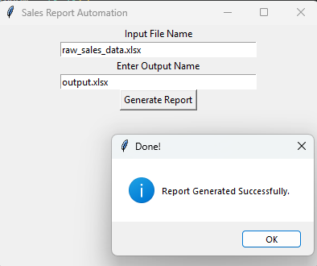

# 📈 Sales Report Automation Tool

A Python automation tool that takes a messy Excel sales file and generates a professional formatted report — with just one click!

Built with **Python**, **Pandas**, **openpyxl**, and **Tkinter**.

---

## 🖥️ GUI Preview



---

## ✨ Features

- Cleans messy data — missing values, inconsistent names
- Generates a professionally formatted Excel report
- Creates **Monthly Summary** and **Product Summary** sheets
- Adds **bar charts** automatically
- Simple and clean GUI — no coding required to use
- Error handling for missing or incorrect files

---

## 📦 Requirements

Install dependencies using pip:

```bash
pip install pandas openpyxl
```

---

## 🚀 How to Use

1. Clone the repository:
```bash
git clone https://github.com/abdullahautomation/sales-report-automation.git
```

2. Navigate to the project folder:
```bash
cd sales-report-automation
```

3. Place your Excel file in the same folder

4. Run the GUI:
```bash
python gui.py
```

5. Enter input file name: `raw_sales_data.xlsx`
6. Enter output file name: `my_report.xlsx`
7. Click **Generate Report** — done! ✅

---

## 📋 Input File Requirements

Your Excel file must have these columns:

| Column | Description |
|--------|-------------|
| Order_ID | Unique order number |
| Salesperson | Name of salesperson |
| Product | Product name |
| Region | Sales region |
| Sale_Amount | Sale value |
| Month | Month of sale |

---

## 📊 Output

A professionally formatted Excel file with:
- ✅ Cleaned Data sheet
- ✅ Monthly Summary sheet with chart
- ✅ Product Summary sheet with chart

---

## 📁 Project Structure

```
sales-report-automation/
│
├── gui.py              # Tkinter GUI
├── main_script.py      # Report generation logic
├── raw_sales_data.xlsx # Sample input file
├── demo.png            # GUI screenshot
├── .gitignore
└── README.md
```

---

## 🛠️ Built With

- [Python](https://www.python.org/)
- [Pandas](https://pandas.pydata.org/)
- [openpyxl](https://openpyxl.readthedocs.io/)
- [Tkinter](https://docs.python.org/3/library/tkinter.html)

---

## 👨‍💻 Author

**Abdullah**  
🔗 [GitHub](https://github.com/abdullahautomation)  
🌐 [Fiverr](https://www.fiverr.com/abdullah7514)

---

## 📃 License

This project is open source and available under the [MIT License](LICENSE).